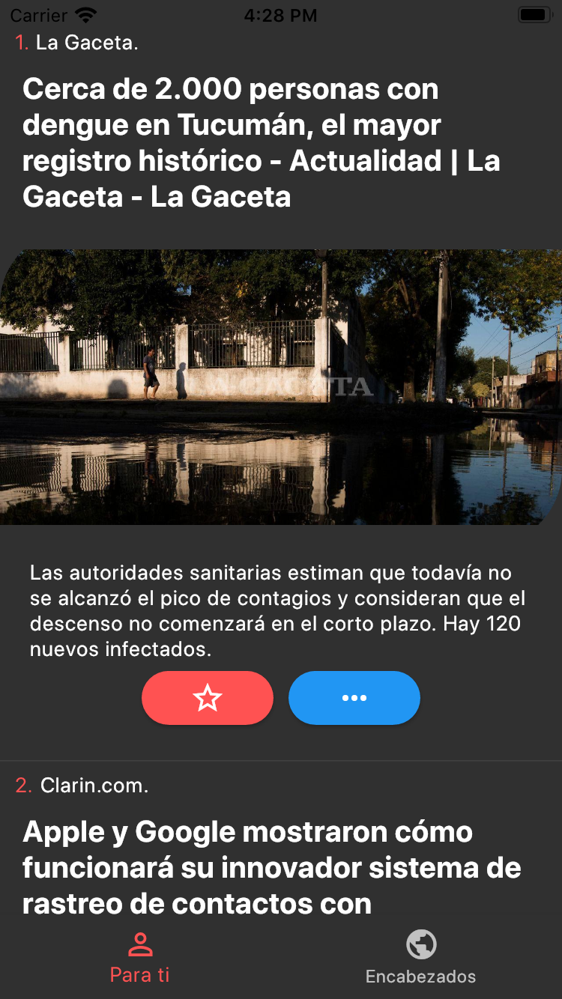

# Flutter News App

A new Flutter project that conect a real news API https://newsapi.org/

This project:
- connects a real news API
- manages complex models from JSON
- manages the theme of the app
- reuse a custom widget
- use providers to notify others widgets (ChangeNotifier and notifyListeners();) 

